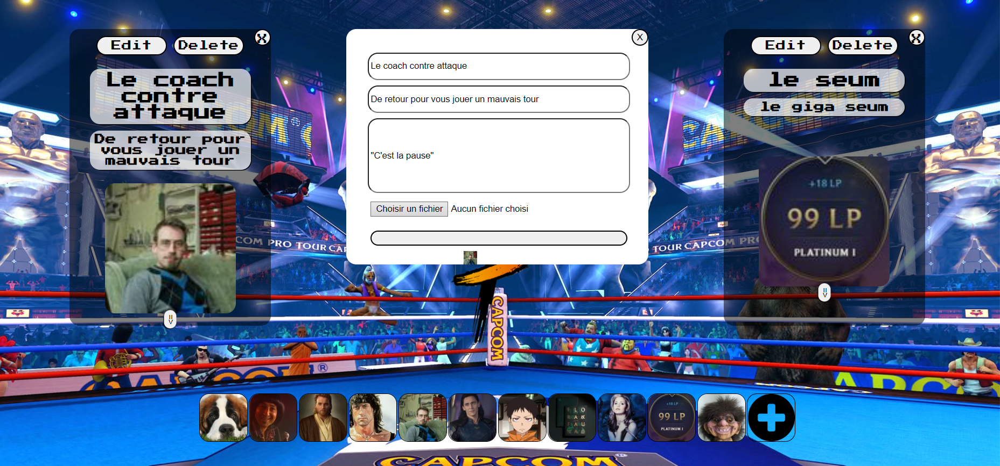
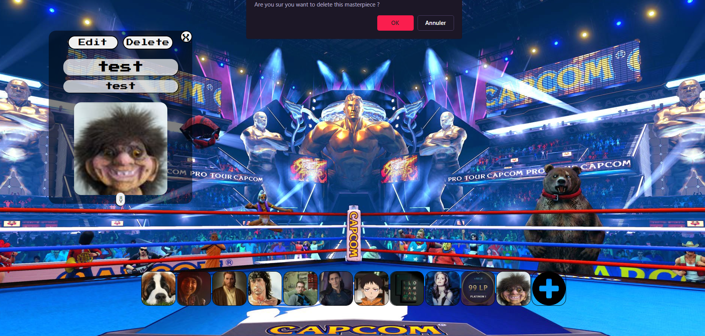
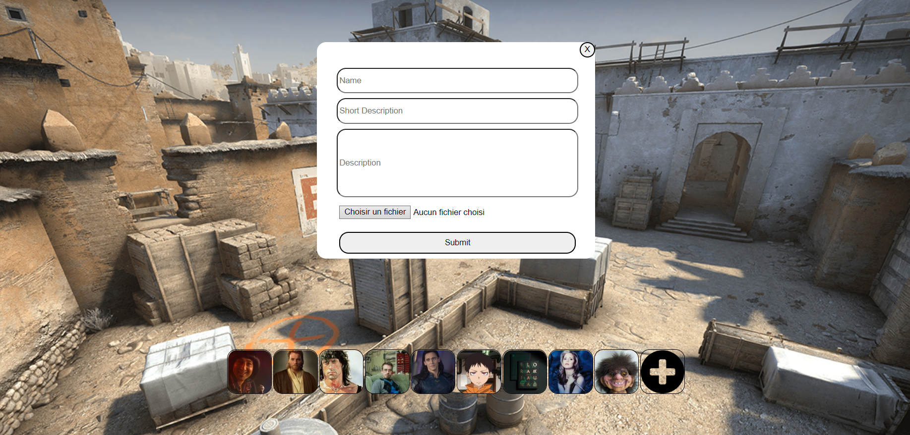

# character-manager-js

Select, Create, Edit or Delete a character

## Authors

- [@TanguyIglesias](https://github.com/TanguyIglesias)

- [@st2eve](https://github.com/st2eve)

## Tech Stack

**Client:** HTML, CSS, Saas, JS

**Server:** N/A

## Used By

This project is used by the following companies:

- Becode

## Link

https://tanguyiglesias.github.io/character-manager-js/

## Preview

### Accueil

### Sélection 1er Personnage

### Sélection 2ème Personnage

### Edition d'un personnage

### Suppression d'un personnage

### Création d'un personnage

